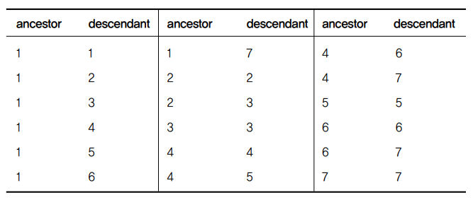
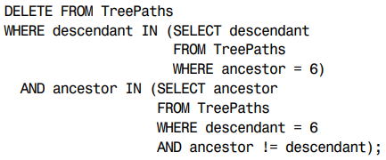
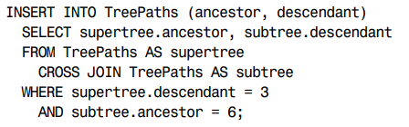
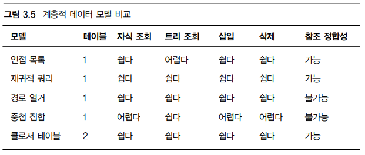

# 안티패턴
## 개요
---
### 안티패턴: 널리 사용되지만 실제로는 좋지 않은 패

- 어떤 문제를 해결하려는 의도로 사용하지만 실제로는 더 많은 문제를 유발하는 패턴

### 구성

- 논리적 데이터베이스 설계 안티패턴: 저장 정보, DB관계 정리
- 물리적 데이터베이스 설계 안티패턴: 효율적 데이터 관리로 index, DDL 정리
- 쿼리 안티패턴: 데이터 입력조회 DML
- 애플리케이션 개발 안티패턴: java, python 등 다른 언어 애플리케이션 내 사용되는 SQL

### 안티패턴의 구조

- 목표
  - 해결하려는 작업이자만 안티패턴 사용으로 더 많은 문제 발생
- 안티패턴
  - 흔한 해법의 속성과 이를 안티패턴으로 만드는 예상외 결과
- 안티패턴 인식 방법
  - 안티패턴 단서 찾기
- 안티패턴 사용이 합당한 경우
  - 예외가 있기 마련
- 해법
  - 안티패턴을 막으며 원래 목표 달성 해법

## 논리적 데이터베이스 설계 안티패턴
---
### 무단횡단
> 다대다 교차테이블 피하기 위해 쉼표 구분 데이터를 사용하는 것

- 목표
  - 담당자와 제품의 다대일 관계를 일대다 관계도 지원하기
    - 해법(상현, 은태): 중간 테이블 생성 (중간에 FK 삭제 가능?) OK
    - 해법(형주): FK없는 다대다 관계 생성
- 안티패턴
  - 쉼표로 구분된 목록에 저장
    - 특정 담당자의 제품을 찾으려면 REGEXP 패턴매칭이 필요
      - 잘못된 결과 리턴 가능
      - 인덱스 활용 불가
      - 패턴매칭은 DB 제품 마다 다름 (벤더 중립적이지 못함)
    - 주어진 제품에 대한 계정 정보 조회 불편
      - 인덱스 활용 조인 불가
    - 집계 쿼리 사용 불가 count(), sum(), avg() 등
      - 대체 로직 작성이 필요하나, 부정확하며 난해함
    - 특정 제품에 대한 계정 갱신 불편
      - 새 아이디 추가는 가능하나 정렬된 상태가 아님
      - 한 아이디 삭제 위해 큰 비용
        - 목록을 일기 -> 대상 아이디만 제거 -> 나머지 아이디 붙여서 업데이트
    - 아이디 유효성 검증 불가
      - 숫자인 아이디 경우 'banana' 같은 문자도 입력 가능
    - 구분자 문자를 포함한 데이터 문제
    - 데이터 길이 제한 varchar(30), varchar(60) ...
- 안티패턴 인식 방법
  - 이 목록이 지원하는 최대 항목 수는?
    - varchar 최대 길이 확인 위한 질문
  - SQL에서 단어 경계를 어떻게 알지?
    - 문자열 일부 검색 위한 질문
  - 이 목록에서 절대 안 나올 문자는?
    - 구분자 사용위한 질문
- 안티패턴 사용이 합당한 경우
  - 구분자 사용은 반정규화의 일종
    - 정규화가 먼저, 반정규화는 보수적으로 접근
  - 애플리케이션에서 구분자 형식의 데이터가 필요한 경우
  - 목록 내 개별 항목에 접근 필요 없는 경우
  - 다른 DB 구분자 형식 항목을 그대로 사용하며, 분리 불필요 경우 
- 해법: 교차 테이블 생성
  - Contacts 테이블로 Products와 Accounts사이 다대다 관계 구현
    - FK(product_id), FK(account_id)
    - FK로 두 테이블 참조: 교차테이블
      - 영어: join table, many-to-many table, mapping table
  - Contacts 테이블 조인으로 계정 및 제품 조회 가능
  - Group By로 집계 쿼리 가능
  - 특정 제품에 대한 계정 갱신
    - Contacts 테이블 행 추가 및 삭제
  - 제품 아이디 유효성 검증
    - FK참조로 존재하는 데이터만 입력 가능
    - 데이터 타입으로 제한 가능
  - 구분자 문자 선택 필요 없음
  - 목록길이 제한이 필요하다면 애플리케이션에서 항목 수로 제한
  - 교차테이블의 다른 장점
    - 인덱스 활용으로 성능 향상
      - FK선언 칼럼: 내부적 인덱스 생성(각 DB문서 확인 필요)
    - 칼럼 추가로 다른 정보 저장 가능

### 순진한 트리

- 목표: 계층구조 저장 및 조회하기
  - 트리 데이터 구조에서 각 항목은 노드라 부름
    - 노드: 여라 자식과 한 부모를 지님
    - Root(뿌리): 부모가 없는 최상위 노드
    - Leaf(종말노드): 가장 아래 자식이 없는 노드
    - non-leaf(노드): 중간에 있는 노드
  - 실제 사례
    - 조직도: 직원과 관리자 관계
    - 글타래: 답글과 답글의 답글
    - 부품도: 부품 속 부품

- 안티패턴: 항상 부모에 의존하기(인접목록)
  - parent_id 칼럼으로 같은 테이블 내 다른 글 참조
    - 인접 목록(Adjacency)라고 부름
    - 계층 데이터에 흔한 설계

  - 인접 목록에서 트리 조회하기
    - 자식 조회는 가능하나, 자식 아래 후손은 조회 불가
    - 집계 함수로 총량 등 계산 불가
    - 모든 행을 가져와 애플리케이션으로 계층구조 생성 필요

  - 인접 목록에서 트리 유지하기
    - 노드 추가 쉬움 parent_id 지정
    - 노드 혹은 서브트리 이동은 쉬움 parent_id 변경
    - **노드 삭제는 어려움**
      - 여러번 쿼리 날려 모든 자손 찾음
      - 가장 아래 자손부터 차례로 삭제
      - 혹은 ON DELETE CASCADE 옵션으로 자손 일괄 삭제
      - 삭제 노드의 자식을 부모에 붙이기 까다로움
        - 자식**들**의 parent_id 변경후, 삭제

- 안티패턴 인식 방법
  - 트리에서 얼마나 깊은 단계를 지원해야 하지?
    - 재귀적 쿼리 미사용 증거로, 제한된 깊이 질문
  - 트리 데이터 구조 관리 코드 수정이 겁나
  - 트리 내 고아 노드 정리 스크립트를 주기적으로 돌려야해
    - 자식이 있는 노드 삭제로 연결이 끊긴 고아 노드
    - 데이터 구조 유지 위한 트리거와 FK 제약조건 뒤에 소개

- 안티패턴 사용이 합당한 경우
  - 부모 자식 노드로 충분한 경우(새 노드 추가도 쉬움)
    - **한 단계 깊이로 충분하다면, 복잡하게 만들 필요 없다**
    - 인접 목록 형식 계층구조 지원 DBMS존재
    - SQL-99 표준 재귀적 쿼리 문법 정의
      - WITH 키워드에 CTE(Common Table Expression) 사용

      ```sql
      WITH CommentTree
        (comment_id, bug_id, parent_id, author, comment, depth)
      AS (
        SELECT *, 0 AS depth FROM Comments
        WHERE parent_id IS NULL
        UNION ALL
        SELECT c.*, ct.depth+1 AS depth FROM CommentTree ct
        JOIN Comments c ON (ct.comment_id = c.parent_id)
      )
      SELECT * FROM CommentTree WHERE bug_id = 1234;
      ```

      - SQL Server 2005, Oracle 11g, IBM DB2, PostgreSQL 8.4 CTE사용 재귀적 쿼리 지원
      - Oracle 9i, 10g는 START WITH와 CONNECT BY PRIOR 전용문법으로 재귀적 쿼리 구현 가능

      ```SQL
      SELECT * FROM Comments
      START WITH Comment_id = 9876
      CONNECT BY PRIOR parent_id = comment_id;
      ```

- 해법: 대안 트리 모델 사용
  - 대안 3개: 경로 열거(Path Enumeration), 중첩 집합(Nested Sets), 클로저 테이블(Closure Table)
  - 경로 열거(Path Enumeration)
    - 조상 경로를 각 노드 속성으로 저장
    - parent_id 대신 path(VARCHAR) 칼럼 정의해 트리 Root부터 현재 행까지 저장(/구분자 사용OK)
    - LIKE로 조상 및 후손 찾기

      ```SQL
      -- 조상 찾기
      SELECT *
      FROM Comments AS c
      WHERE '1/4/7/10' LIKE c.path || '%';  -- 변수와 칼럼 위치 변경이 새롭다
      -- 매치: 1/4/7/%, 1/4/%, 1/%

      -- 후손 찾기
      SELECT *
      FROM Comments AS c
      WHERE c.path LIKE '1/4/' LIKE c.path || '%';
      -- 매치: 1/4/5/, 1/4/6/, 1/4/6/7/
      ```

    - GROUP BY로 집계하기

      ```sql
      SELECT COUNT(*)
      FROM Comments AS c
      WHERE c.path LIKE '1/4/' LIKE c.path || '%';
      GROUP BY c.author;
      ```

    - 노드 추가
      - 부모 경로 복사해 새 노드 아이디 덧붙임
      - PK자동 생성되는 경우, 행 추가 후 경로 갱신
    - 단점
      - 올바른 경로 형성 및 실제 노드 대응을 강제 못함
      - 경로 문자열 유지는 애플리케이션 코드에 종속되며, 검증 비용이 큼
      - 문자열 길이 만큼 트리 깊이 제한됨

  - 중첩 집합(Nested Sets)
    - 자손 집합에 대한 정보 저장
      - nsleft: 모든 자손의 nsleft 보다 작아야 함
      - nsright: 모든 자손의 nsright 보다 커야 함  
      

      ```sql
      -- 자손: 현재 노드#4의 nsleft와 nsright 사이의 nsleft 검색
      SELECT c2.*
      FROM Comments AS c1
      JOIN Comments AS c2
        ON c2.nsleft BETWEEN c1.nsleft AND c1.nsright
      WHERE c1.comment_id = 4;

      -- 조상: 현재 노드#6의 nsleft와 nsright 사이의 nsleft 검색
      SELECT c2.*
      FROM Comments AS c1
      JOIN Comments AS c2
        ON c1.nsleft BETWEEN c2.nsleft AND c2.nsright
      WHERE c1.comment_id = 6;
      ```

      - 자식 노드 삭제시 그 자손은 자식 노드가 됨(값 간격 문제 없음)
    - 단점
      - 부모 자식 찾기 어려움  
      
      - 데이터 추가가 어려움
        - 새 노드의 왼쪽 값보다 큰 모든 노드의 왼쪽, 오른쪽 값 재계산 필요  
        
    - 서브트리 조회에 적절하며, 잦은 노드추가에는 부적절

  - 클로저 테이블(Closure Table)
    - 트리 모든 경로를 별도 테이블에 저장
      - ancestor, descendant: Comments테이블 id 참조(자기참조도 저장)  
      
      - JOIN과 ancestor, descendant칼럼 이용해 조상/자손 검색
      - 노드#5 새로운 자식 추가
        - 자기 참조 행 추가
        - 노드#5가 자식인 모든 노드 복사해 descendent에 새 노드 아이디 입력
      - 노드#7 삭제
        - 노드#7가 descendent인 모든 경로 정보 삭제
        - 실제 노드가 삭제 되는 것은 아님에 유의(제품일람표, 조직도에 유용)
      - 노드 이동
        - 모든 조상 노드와의 관계 삭제
        - 자신과 후손 관계는 유지  
        
        - 새 위치의 조상들에 자손으로서 행 추가
          - CROSS JOIN으로 모든 노드 대응  
          
      - path_length 속성 추가로 깊이 검색 개선
        - **path_length는 어떻게 추가하나?**
    - 단점: 계산을 줄이는 대신 많은 저장공간 필요
  
  - 대안 비교  
    

### 아이디가 필요해

- 목표: PK 관례 확립
  - PK는  중요하고 필요한 테이블의 일부
  - 모든 행이 유일함을 보장
    - 각 행 접근 논리적 메커니즘
    - 중복 행 저장 방지
    - FK 참조
    - PK가 없는 것은 제목 없이 음악을 저장하는 것과 같음
  - PK 칼럼 선정이 까다로움
    - 보통 데이터는 중복 가능성 존재
    - PK용 칼럼 지정도 방법
      - 다른 칼럼 중복 허용하며 특정 행에 유일한 접근 가능
      - 명칭: 가상키(pseudokey), 대체키(surrogate key)
      - 가상키는 유용하나, PK 선언에 유일한 방법은 아님

- 안티패턴: 만능키
  - 모든 테이블이 갖는 PK 칼럼 관례
    - PK 칼럼 이름은 id
    - 데이터 타입은 정수
    - 자동 생성
    - 모든 테이블 id칼럼 추가는 그 사용을 이상하게 만드는 몇 가지 효과 초래
  - 중복 키 생성
    - 다른 칼럼이 PK로 사용돌 수 있는 상황에서도 id PK키 생성
  - 중복 행 허용
    - 두 칼럼 이상의 조합인 복합키가 유일성을 나타내는 상황
      - id PK를 사용하면 조합 칼럼이 중복되어 저장 가능
      - 복합 칼럼에 UNIQUE 제약을 건다면 id PK 불필요
  - 모호한 키의 의미
    - id는 너무 일반적 이름으로 의미가 불명확
      - office_id, account_id와 같이 엔터티 타입의 실마리 제공 필요
    - JOIN시 문제 발생
  - USING 사용
    - 모든 PK이름이 id라면 USING문 사용 불가

    ```SQL
    SELECT * FROM Bugs AS b
      JOIN BugsProducts AS bp ON (b.bug_id = bp.bug_id);

    -- 위와 동일
    SELECT * FROM Bugs AS JOIN USING (bug_id);

    -- 모든 PK가 id인 경우
    SELECT * FROM Bugs AS b
      JOIN BugsProducts AS bp ON (b.id = bp.bug_id);
    ```

  - 어려운 복합키
    - 복합PK가 필요하면 복합PK를 사용해야 한다
    - 참조FK 자신도 복합FK가 되어야 함

- 안티패턴 인식 방법
  - 테이블 PK칼럼명에 id가 지나치게 많은 경우
    - 의미 있는 이름 대신 id를 선호할 이유는 없다.
  - 이 테이블에서는 PK가 없어도 될 것 같다
    - 모든 테이블은 중복 해 방지 위해 PK 제약 필요
  - 다대다 연결에서 왜 중복이 있지?
    - FK칼럼 묶어 PK제약 혹은 최소 UNIQUE 제약 필요
  - 값 참조위해 매번 id로 조인하고 싶지 않아
    - 정규화에 대한 오해로 정규하는 가상키와 상관 없음

- 안티패턴 사용이 합당한 경우
  - 객체-관계 프레임워크에서 정수 id인 PK를 제공
    - 하지만 모든 테이블에 가상키가 필요치 않음
    - 모든 가상키가 id일 필요도 없음
  - 지나치게 긴 자연키 대체용으로 적절
    - 파일경로는 좋은 자연키로 가능하나, 인덱스 유지 비용이 높음
    - 옮긴이: 다수 칼럼 조합의 경우도 대체키 사용이 나음

- 해법: 상황에 맞추기
  - 있는 그대로 말하기
    - 예로 Bug 테이블 PK는 bug_id
      - FK가 아닌 한 동일 PK명 다른 테이블에서 금지
      - FK는 연결의 본질을 표현하는 이름 사용 가능
        - FOREIGN KEY (reported_by) REFERENCES Accounts(accoint_id)
      - 테이블 컬럼 이름 짓기 책: [Joe Celko's SQL Programming Style](https://www.amazon.co.jp/Programming-Kaufmann-Management-Systems-English-ebook/dp/B006L21AO6/ref=tmm_kin_swatch_0?_encoding=UTF8&qid=1603721497&sr=8-1)
  - 관례에서 벗어나기
    - 프레임워크 지원 id 재설정 방법 탐구(루비)
  - 자연키와 복합기 포용
    - 유일성과 Not Null이 보장되는 칼럼을 PK로 지정
      - 꼭 가상키를 사용할 필요는 없음
    - 복합키가 적절할 시에는 복합키를 사용
      - 복합PK 참조 FK 또한 복합키가 되어야 함

### 키가 없는 엔트리

- 목표: 데이터베이스 아키텍처 단순화
  - FK제약조건은 부모 테이블에 PK 또는 유일키 존재 필수
  - FK무시하라는 말들
    - 데이터 업데이트 시 제약조건과 충돌 가능
    - 참조 정합성 제약조건 지원불가인 융통성 있는 DB설계 사용
    - DB가 자동생성하는 FK의 인덱스로 성능에 영향을 받는다는 생각
    - FK 미지원 DB 사용

- 안티패턴: 제약조건 무시
  - 무결점 코드
    - 애플리케이션 코드로 참조 데이터 존재여부 확인 후 등록 및 삭제 실시
      - 등록하려는 데이터의 부모 데이터가 있는가
      - 삭제하려는 데이터의 자녀 데이터가 있는가
    - 참조 데이터 존재여부 확인부터 해당 테이블을 잠금
      - 동시성(concurrency)과 확장적응성(scalability)이 낮아짐
  - 오류 확인
    - 참조 정합성이 안 맞는 데이터 찾는 비용 발생
      - 찾아도 처리방법에 대한 문제(삭제? DEFAULT 표시?)

      ```sql
      SELECT b.bug_id, b.status
      FROM Bugs b LEFT OUTER JOIN BugStatus s
        ON (b.status = s.status)
      WHERE s.status IS NULL;
      ```

  - 데이터 조작에 대한 확신 불가
    - 모든 DB 데이터 조작 코드는 완벽하지 않음
    - 스크립트로 DB를 직접 수정하여 오차 발생 가능
  - 진퇴양난 업데이트
    - 추가 및 삭제는 부모 및 자식 데이터를 조작하여 가능
    - 부모 자식 동시 업데이트 불가
      - 부모 업데이트 전, 자식 업데이트 불가
      - 자식 업데이트 전, 부모 업데이트 불가
- 안티패턴 인식 방법
  - 한 테이블에는 있지만 다른 테이블에는 없는 값은 어떻게 찾지?
    - 고아 데이터 찾기
  - 데이트 등록시 다른 테이블에 값이 있는 지 확인 방법이 뭐지?
    - 부모행 존재 확인
  - FK는 DB 성능을 떨어뜨리는데?
    - FK가 없으면 오히려 문제를 키운다
- 안티패턴 사용이 합당한 경우
  - FK 미지원 DB 사용
  - 극단적인 유연한 DB 설계
    - 하지만, 이는 엔터티-속성-값 및 다형성 관계 안티패턴의 강한 징후이다

- 해법: 제약조건 선언하기
  - FK제약 선언으로 처음부터 잘못된 데이터 입력 방지
    - 데이터 검증 코드 불필요
    - DB변경에도 모든 코드가 동일 제약조건 따름을 확신
    - 개발, 디버킹, 보수 시간 감소
      - 코드 1000줄에 15~20개 버그는 소프트웨어 업계 평균수치
  - 여러 테이블 변경 지원
    - 단계적 업데이트(cascading update)
    - 자식 테이블 추가 시 FK에 단계적 동작 기술
      ```SQL
      FOREIGN KEY (status) REFERENCES BugStatus(status)
        ON UPDATE CASCADE    -- 부모따라 자동 업데이트
        ON DELETE SET DEFAULT
        --ON DELETE RESTRICT  -- 부모 행 삭제 억제
      ```
  - 오버헤드는 다른 대안에 비해 오하려 적다
    - INSERT, UPDATE, DELETE 전에 데이터 확인용 SELECT 불필요
    - 여러 테이블 변경 위해 데이블 잠금 불필요
    - 고아 데이터 정정 위해 품질 제어 스크립트 실행 불필요
  - FK는 쉬운 사용, 성능 향상, 참조 정합성 유지의 장점이 있다


### 엔터티-속성-값

- 목표: 가변 속성 지원
  - 테이블은 속성집합으로 객체를 나타낼 수 있음
  - 현대 객체지향 프로그램은 상속 등으로 확장 가능
  - 확장된 객체 정보를 테이블 행으로 저장하고 싶음

- 안티패턴: 범용 속성 테이블 사용
  - 엔터티-속성-값: 각 행이 속성을 나타내는 설계
    - 엔터티: (보통)한 엔터티에 한 행을 가지는 부모 테이블에 대한 FK칼럼
    - 속성: 일반 테이블에서 칼럼명을 나태내나, 이 설계에서는 각 행마다 속성이 들어감
    - 값: 각 속성에 대한 값

      ```SQL
      CREATE TABLE Issues (
        issue_id SERIAL PRIMARY KEY
      );
      
      CREATE TABLE IssueAttributes (
        issue_id BIGINT UNSIGNED NOT NULL,
        attr_name VARCHAR(100) NOT NULL,
        attr_value VARVHAR(100),
        PRIMARY KEY (issue_id, attr_name)
        FOREIGN KEY (issue_id) REFERENCES Issues(issue_id)
      );
      ```

  - 보이는 이득
    - 두 테이블 모두 적은 칼럼 소유
    - 새 속성은 칼럼 추가 없이 행 추가로 가능
    - 비사용 속성을 NULL로 표시한 칼럼 없어도 됨
    - 그러나, 사용이 어려움(개선된 설계로 보이지만)
  - 속성 조회
    - SELECT 칼럼명으로 끝날 일을 WHERE 속성명 지정으로 복잡하게 수행
  - 데이터 정합성 지원
    - 필수 속성 사용 불가
      - 칼럼입력을 NOT NULL로 강제 불가
      - 행에 대한 입력 강제이기에 애플리케이션 코드 작성 필요
    - SQL 데이터 타입 사용 불가
      - DATE, INT 등 상제 불가
    - 참조 정합성 강제 불가
      - 색인 테이블에 대한 FK정의로 입력 범위 제한 불가

        ```SQL
        FOREIGN KEY (status) REFERENCES BugStatus(status)
        ```

    - 속성 이름 강제 불가
      - 같은 의미 데이터를 date_reported 혹은 report_date로 저장 가능
      - 서브 커리로 집계 가능하나 이도 불확실
      - attr_name칼럼이 칼럼명 테이블을 참조하는 FK제약 가능하나, 속성명 추가제한 발생

        ```SQL
        SELECT date_reported, COUNT(*) AS bugs_per_date
        FROM (SELECT DISTINCT issue_id, attr_value AS date_reported
        FROM IssueAttributes
        WHERE attr_name IN ('date_reported', 'report_date'))
        GROUP BY date_reported;
        ```

  - 행 재구성하기
    - 한 행의 일부로 속성검색은 많은 조인 필요

      ```SQL
      SELECT i.issue_id,
        i1.attr_value AS "date_reported",
        i2.attr_value AS "status",
        i3.attr_value AS "priority",
        i4.attr_value AS "description"
      FROM Issues AS i
        LEFT OUTER JOIN IssueAttributes AS i1
          ON i.issue_id = i1.issue_id AND i1.attr_name = 'date_reported'
        LEFT OUTER JOIN IssueAttributes AS i2
          ON i.issue_id = i2.issue_id AND i2.attr_name = 'status'
        LEFT OUTER JOIN IssueAttributes AS i3
          ON i.issue_id = i3.issue_id AND i3.attr_name = 'priority';
        LEFT OUTER JOIN IssueAttributes AS i4
          ON i.issue_id = i4.issue_id AND i4.attr_name = 'description';
      WHERE i.issue_id = 1234;
      ```

    - CASE문 사용시 여러 조인 없이 가능하나, 모든 칼럼명 파악과 복잡 쿼리 문제가 남음

      ```SQL
      SELECT issue_id, MAX(date_reported), MAX(status), MAX(priority), MAX(description)
      FROM (
        SELECT issue_id,
          CASE WHEN attr_name='date_reported' THEN attr_value END date_reported,
          CASE WHEN attr_name='status' THEN attr_value END status,
          CASE WHEN attr_name='priority' THEN attr_value END priority,
          CASE WHEN attr_name='description' THEN attr_value END description
        FROM IssueAttributes
        WHERE issue_id=1234
      ) t
      GROUP BY issue_id;
      ```

    - 결국 쿼리 비용이 높음

- 안티패턴 인식 방법
  - 
- 안티패턴 사용이 합당한 경우
  - 
- 해법
  - 

### 형식

- 목표: 
  - 
- 안티패턴
  - 
- 안티패턴 인식 방법
  - 
- 안티패턴 사용이 합당한 경우
  - 
- 해법
  - 
