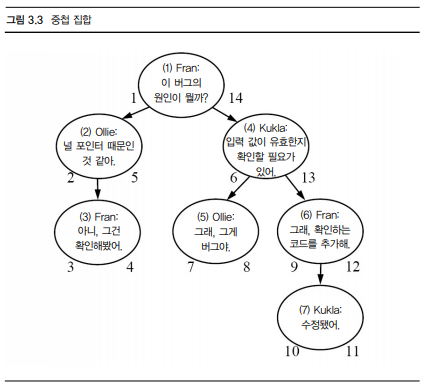
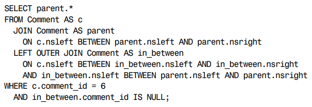
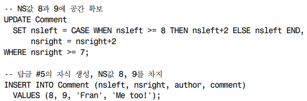

# 안티패턴
## 개요
---
### 안티패턴: 널리 사용되지만 실제로는 좋지 않은 패
 - 어떤 문제를 해결하려는 의도로 사용하지만 실제로는 더 많은 문제를 유발하는 패턴

### 구성
- 논리적 데이터베이스 설계 안티패턴: 저장 정보, DB관계 정리
- 물리적 데이터베이스 설계 안티패턴: 효율적 데이터 관리로 index, DDL 정리
- 쿼리 안티패턴: 데이터 입력조회 DML
- 애플리케이션 개발 안티패턴: java, python 등 다른 언어 애플리케이션 내 사용되는 SQL

### 안티패턴의 구조
- 목표
    - 해결하려는 작업이자만 안티패턴 사용으로 더 많은 문제 발생
- 안티패턴
    - 흔한 해법의 속성과 이를 안티패턴으로 만드는 예상외 결과
- 안티패턴 인식 방법
    - 안티패턴 단서 찾기
- 안티패턴 사용이 합당한 경우
    - 예외가 있기 마련
- 해법
    - 안티패턴을 막으며 원래 목표 달성 해법

## 논리적 데이터베이스 설계 안티패턴
---
### 무단횡단
> 다대다 교차테이블 피하기 위해 쉼표 구분 데이터를 사용하는 것
- 목표
    - 담당자와 제품의 다대일 관계를 일대다 관계도 지원하기
        - 해법(상현, 은태): 중간 테이블 생성 (중간에 FK 삭제 가능?) OK
        - 해법(형주): FK없는 다대다 관계 생성
- 안티패턴
    - 쉼표로 구분된 목록에 저장
        - 특정 담당자의 제품을 찾으려면 REGEXP 패턴매칭이 필요
            - 잘못된 결과 리턴 가능
            - 인덱스 활용 불가
            - 패턴매칭은 DB 제품 마다 다름 (벤더 중립적이지 못함)
        - 주어진 제품에 대한 계정 정보 조회 불편
            - 인덱스 활용 조인 불가
        - 집계 쿼리 사용 불가 count(), sum(), avg() 등
            - 대체 로직 작성이 필요하나, 부정확하며 난해함
        - 특정 제품에 대한 계정 갱신 불편
            - 새 아이디 추가는 가능하나 정렬된 상태가 아님
            - 한 아이디 삭제 위해 큰 비용
                - 목록을 일기 -> 대상 아이디만 제거 -> 나머지 아이디 붙여서 업데이트
        - 아이디 유효성 검증 불가
            - 숫자인 아이디 경우 'banana' 같은 문자도 입력 가능
        - 구분자 문자를 포함한 데이터 문제
        - 데이터 길이 제한 varchar(30), varchar(60) ...
- 안티패턴 인식 방법
    - 이 목록이 지원하는 최대 항목 수는?
        - varchar 최대 길이 확인 위한 질문
    - SQL에서 단어 경계를 어떻게 알지?
        - 문자열 일부 검색 위한 질문
    - 이 목록에서 절대 안 나올 문자는?
        - 구분자 사용위한 질문
- 안티패턴 사용이 합당한 경우
    - 구분자 사용은 반정규화의 일종
        - 정규화가 먼저, 반정규화는 보수적으로 접근
    - 애플리케이션에서 구분자 형식의 데이터가 필요한 경우
    - 목록 내 개별 항목에 접근 필요 없는 경우
    - 다른 DB 구분자 형식 항목을 그대로 사용하며, 분리 불필요 경우 
- 해법: 교차 테이블 생성
    - Contacts 테이블로 Products와 Accounts사이 다대다 관계 구현
        - FK(product_id), FK(account_id)
        - FK로 두 테이블 참조: 교차테이블
            - 영어: join table, many-to-many table, mapping table
    - Contacts 테이블 조인으로 계정 및 제품 조회 가능
    - Group By로 집계 쿼리 가능
    - 특정 제품에 대한 계정 갱신
        - Contacts 테이블 행 추가 및 삭제
    - 제품 아이디 유효성 검증
        - FK참조로 존재하는 데이터만 입력 가능
        - 데이터 타입으로 제한 가능
    - 구분자 문자 선택 필요 없음
    - 목록길이 제한이 필요하다면 애플리케이션에서 항목 수로 제한
    - 교차테이블의 다른 장점
        - 인덱스 활용으로 성능 향상
            - FK선언 칼럼: 내부적 인덱스 생성(각 DB문서 확인 필요)
        - 칼럼 추가로 다른 정보 저장 가능

### 순진한 트리
- 목표: 계층구조 저장 및 조회하기
    - 트리 데이터 구조에서 각 항목은 노드라 부름
        - 노드: 여라 자식과 한 부모를 지님
        - Root(뿌리): 부모가 없는 최상위 노드
        - Leaf(종말노드): 가장 아래 자식이 없는 노드
        - non-leaf(노드): 중간에 있는 노드
    - 실제 사례
        - 조직도: 직원과 관리자 관계
        - 글타래: 답글과 답글의 답글
        - 부품도: 부품 속 부품

- 안티패턴: 항상 부모에 의존하기(인접목록)
    - parent_id 칼럼으로 같은 테이블 내 다른 글 참조
        - 인접 목록(Adjacency)라고 부름
        - 계층 데이터에 흔한 설계

    - 인접 목록에서 트리 조회하기
        - 자식 조회는 가능하나, 자식 아래 후손은 조회 불가
        - 집계 함수로 총량 등 계산 불가
        - 모든 행을 가져와 애플리케이션으로 계층구조 생성 필요

    - 인접 목록에서 트리 유지하기
        - 노드 추가 쉬움 parent_id 지정
        - 노드 혹은 서브트리 이동은 쉬움 parent_id 변경
        - **노드 삭제는 어려움**
            - 여러번 쿼리 날려 모든 자손 찾음
            - 가장 아래 자손부터 차례로 삭제
            - 혹은 ON DELETE CASCADE 옵션으로 자손 일괄 삭제
            - 삭제 노드의 자식을 부모에 붙이기 까다로움
                - 자식**들**의 parent_id 변경후, 삭제

- 안티패턴 인식 방법
    - 트리에서 얼마나 깊은 단계를 지원해야 하지?
        - 재귀적 쿼리 미사용 증거로, 제한된 깊이 질문
    - 트리 데이터 구조 관리 코드 수정이 겁나
    - 트리 내 고아 노드 정리 스크립트를 주기적으로 돌려야해
        - 자식이 있는 노드 삭제로 연결이 끊긴 고아 노드
        - 데이터 구조 유지 위한 트리거와 FK 제약조건 뒤에 소개

- 안티패턴 사용이 합당한 경우
    - 부모 자식 노드로 충분한 경우(새 노드 추가도 쉬움)
        - **한 단계 깊이로 충분하다면, 복잡하게 만들 필요 없다**
        - 인접 목록 형식 계층구조 지원 DBMS존재
        - SQL-99 표준 재귀적 쿼리 문법 정의
            - WITH 키워드에 CTE(Common Table Expression) 사용
            ```sql
            WITH CommentTree
                (comment_id, bug_id, parent_id, author, comment, depth)
            AS (
                SELECT *, 0 AS depth FROM Comments
                WHERE parent_id IS NULL
              UNION ALL
                SELECT c.*, ct.depth+1 AS depth FROM CommentTree ct
                JOIN Comments c ON (ct.comment_id = c.parent_id)
            )
            SELECT * FROM CommentTree WHERE bug_id = 1234;
            ```
            - SQL Server 2005, Oracle 11g, IBM DB2, PostgreSQL 8.4 CTE사용 재귀적 쿼리 지원
            - Oracle 9i, 10g는 START WITH와 CONNECT BY PRIOR 전용문법으로 재귀적 쿼리 구현 가능
            ```SQL
            SELECT * FROM Comments
            START WITH Comment_id = 9876
            CONNECT BY PRIOR parent_id = comment_id;
            ```

- 해법: 대안 트리 모델 사용
    - 대안 3개: 경로 열거(Path Enumeration), 중첩 집합(Nested Sets), 클로저 테이블(Closure Table)
    - 경로 열거(Path Enumeration)
        - 조상 경로를 각 노드 속성으로 저장
        - parent_id 대신 path(VARCHAR) 칼럼 정의해 트리 Root부터 현재 행까지 저장(/구분자 사용OK)
        - LIKE로 조상 및 후손 찾기
            ```SQL
            -- 조상 찾기
            SELECT *
            FROM Comments AS c
            WHERE '1/4/7/10' LIKE c.path || '%';  -- 변수와 칼럼 위치 변경이 새롭다
            -- 매치: 1/4/7/%, 1/4/%, 1/%

            -- 후손 찾기
            SELECT *
            FROM Comments AS c
            WHERE c.path LIKE '1/4/' LIKE c.path || '%';
            -- 매치: 1/4/5/, 1/4/6/, 1/4/6/7/
            ```
        - GROUP BY로 집계하기
            ```sql
            SELECT COUNT(*)
            FROM Comments AS c
            WHERE c.path LIKE '1/4/' LIKE c.path || '%';
            GROUP BY c.author;
            ```
        - 노드 추가
            - 부모 경로 복사해 새 노드 아이디 덧붙임
            - PK자동 생성되는 경우, 행 추가 후 경로 갱신
        - 단점
            - 올바른 경로 형성 및 실제 노드 대응을 강제 못함
            - 경로 문자열 유지는 애플리케이션 코드에 종속되며, 검증 비용이 큼
            - 문자열 길이 만큼 트리 깊이 제한됨

    - 중첩 집합(Nested Sets)
        - 자손 집합에 대한 정보 저장
            - nsleft: 모든 자손의 nsleft 보다 작아야 함
            - nsright: 모든 자손의 nsright 보다 커야 함
            
            ```sql
            -- 자손: 현재 노드#4의 nsleft와 nsright 사이의 nsleft 검색
            SELECT c2.*
            FROM Comments AS c1
            JOIN Comments AS c2
                ON c2.nsleft BETWEEN c1.nsleft AND c1.nsright
            WHERE c1.comment_id = 4;

            -- 조상: 현재 노드#6의 nsleft와 nsright 사이의 nsleft 검색
            SELECT c2.*
            FROM Comments AS c1
            JOIN Comments AS c2
                ON c1.nsleft BETWEEN c2.nsleft AND c2.nsright
            WHERE c1.comment_id = 6;
            ```
            - 자식 노드 삭제시 그 자손은 자식 노드가 됨(값 간격 문제 없음)
        - 단점
            - 부모 자식 찾기 어려움
            
            - 데이터 추가가 어려움
                - 새 노드의 왼쪽 값보다 큰 모든 노드의 왼쪽, 오른쪽 값 재계산 필요
                
        - 서브트리 조회에 적절하며, 잦은 노드추가에는 부적절

### 형식
- 목표: 계층구조 저장 및 조회하기
    - 
- 안티패턴
    - 
- 안티패턴 인식 방법
    - 
- 안티패턴 사용이 합당한 경우
    - 
- 해법
    - 